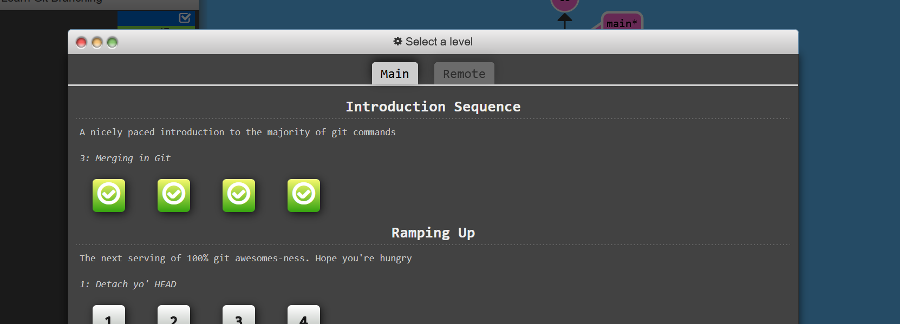

# Learn-Git-Branching

## ScreenShot

## Reflection

### Level 1 - git commit

The git commit is one of the first git commands that I learned. I tend to over commit. I like to make sure I am always up to date on my working tree. I also like to see the history of the process I went through on my projects. I can get insights on my future projects. 

### Level 2 - git branching

I thought that the git checkout -b yourBranchName way to branch and switch at the same time. It is the same as 
git switch -c yourBranchName. Which, I find extremely helpful because I always create a branch and almost always forget to switch from main to my new branch before I start making changes. 

### Level 3 - git merge

The git merge command is a way that we can combine our work. It combines changes from two or more branches into a
single branch. It allows for multiple branches being worked on at the same time and then merge their work together when they are completed. 

### Level 4 - git rebase

The git rebase allows to merge branches together but puts the commits of the branch to be merged on top and moves the history to be one line. It cleans up the branch history making it more readable and easier to manage. 